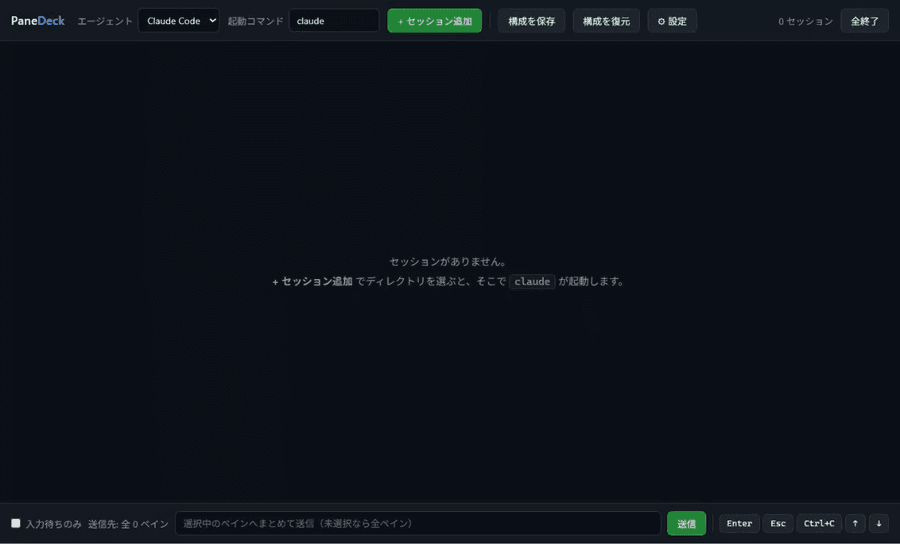

# PaneDeck

[](https://github.com/gamasenninn/panedeck/actions/workflows/test.yml)

[English README](README.md)

複数のコーディングエージェントのセッションをグリッド分割ペインで同時に走らせ、まとめて操作するための Electron ターミナルアプリ。

## これは何か

リポジトリごとにコーディングエージェントを立ち上げて並行作業していると、ターミナルのタブを行ったり来たりして「どれが入力待ちで止まっているか」が分からなくなる。PaneDeck は全セッションを 1 画面に並べ、状態をバッジで示し、同じ指示をまとめて送れるようにする。

起動するのは任意のコマンドなので、CLI で動くエージェントであれば何でも並べられる。状態判定のパターンを同梱しているのは Claude Code と Codex。



`npm run demo` で収録している。セッションはテスト用のフェイク — 実物のエージェントを撮ると手元のパスや進行中の作業が写り込み、撮り直すたびに中身も変わるため。流している出力は実際の判定パターンに一致するものなので、**映っているバッジは演出ではなく判定そのものの結果**。

## 動作環境

- Node.js 24（開発と CI が回している版。これより古い版は未検証）
- Electron v40.x
- **Windows**。macOS / Linux は未検証

意図して Windows 専用にしている箇所は無い（node-pty も xterm.js もクロスプラットフォームで、既定シェルは OS ごとに選んでいる）。ただし動かしたのは Windows だけで、**プラットフォーム差がいちばん出るのが pty の層**。アプリ全体を固めた [#16](https://github.com/gamasenninn/panedeck/issues/16) は ConPTY 固有の不具合で、他の OS では起こりようがなかった。他環境は「壊れている」ではなく「不明」として扱っている。

## セットアップ

```bash
cd panedeck
npm install
npm start        # TypeScript をビルドしてから Electron を起動
```

`node-pty` は N-API のプリビルドを同梱しているため、**再ビルドは通常不要**。N-API は Node と Electron のあいだで ABI が安定しているので、`npm run rebuild` を走らせなくても動く。読み込みに失敗する環境に当たったときだけ実行する。

## パッケージング

```bash
npm run icon     # build/icon.svg → build/icon.png（アイコンを変えたときだけ）
npm run pack     # 実行ファイル一式を release/win-unpacked/ に出す（インストーラは作らない）
npm run dist     # インストーラ / 可搬版を release/ に出す
```

Windows では NSIS インストーラ（`PaneDeck Setup <version>.exe`）と可搬版（`PaneDeck <version>.exe`）が生成される。設定は `electron-builder.yml`。

アイコンは `build/icon.png`（1024x1024）1 枚あれば、`.ico` / `.icns` は electron-builder が生成する。元データは `build/icon.svg` で、そこから `scripts/make-icon.mjs` が PNG を作る。

### パッケージング時の注意

- **`npmRebuild: false` にしてある。** node-pty のプリビルドをそのまま使うため。ソースからの再ビルドを走らせると、winpty の `GetCommitHash.bat` が無くて node-gyp が失敗する
- **node-pty は `asarUnpack` で展開している。** conpty の補助実行ファイルを同梱しており、asar の中の実行ファイルは起動できない

### 生成物の検証

```bash
npm run test:packaged   # pack してから、生成物を実際に起動して検証する
```

パッケージ版だけで起きる問題（asar からファイルが読めない、ネイティブモジュールが読み込めない、ESM の解決に失敗する）を捕まえるためのテスト。開発時のテストでは通らない経路なので分けてある。

## 機能

### 複数ターミナルのグリッド表示

各ペインは独立した pty プロセスを持ち、xterm.js で描画される。ペインをクリックするとフォーカスが移り、キー入力はそのセッションにだけ届く。

列数は設定ダイアログで指定できる（自動 / 1〜6）。自動は幅に応じて折り返す。

### 1 ペインの拡大

ペインヘッダの **拡大** で、そのペインだけを全面に出す。**戻す** で元の並びに戻る。

グリッドを畳んで他を隠すだけなので、**端末は作り直されない** — pty との接続もスクロールバックもそのまま。拡大に合わせて桁数・行数は測り直される。

見え方だけの状態で、保存しない。**送信先の決まり方にも影響しない**（拡大しただけで一斉入力の行き先が変わると驚くため）。拡大中のペインを閉じれば自動で元の並びに戻る。

### ペインの並べ替え

ペインのヘッダを掴んでドラッグすると並べ替えられる。並び順はメインプロセスが持ち、構成の保存・復元でも再現する。端末は作り直されないので、並べ替えても接続もスクロールバックも切れない。

### エージェントプロファイル

ツールバーの **エージェント** で切り替えると、起動コマンドと**入力待ちの判定パターン**がセットで変わる。起動コマンドは後から手で書き換えてもよい（どのバイナリを起動するかと、どのパターンで判定するかは別の選択）。

同梱しているのは **Claude Code / Codex / シェル**。どちらのエージェントも実機のログからパターンを採取して確かめてある。**実機で確かめたものだけを足す方針**で、当て推量の正規表現は入れない（誤判定は取りこぼしより悪い）。

Gemini CLI は一度入れたが外した。判定自体はできていたが、実機で日本語を入力できず（PaneDeck からは UTF-8 で正しく届いていることを確認済みなので、受け取る側の問題）、CLI 自体が更新の対象から外れているように見えたため。`agent: "gemini"` を含む古い構成を読んでも壊れず、既定の Claude Code として扱われる。

### セッションの追加

**+ セッション追加** でディレクトリを選ぶと、そこを cwd としてシェルが起動し、**起動コマンド** 欄の内容が流し込まれる。空にすれば素のシェルが開く。起動コマンドはセッションごとに記憶され、ペインのヘッダに表示される。

### 一斉入力（Broadcast）

下部の入力欄に打った内容を、複数ペインへまとめて送る。

- チェックボックスが**どれも未選択なら全ペイン**、チェックがあれば**そのペインだけ**
- **入力待ちのみ** を有効にすると、**入力待ちで止まっているペインだけ**に絞られる。選択と併用すると積になる
- 絞り込みはメインプロセスが送信時点の状態で判定する（レンダラの表示は最大 300ms 古いため）
- **送るものによって対象が変わる。** テキストは `指示待ち` だけ。Enter / ↑ / ↓ は止まっているペイン全部（`指示待ち`・`確認待ち`・`入力待ち`）。外れたペインがあれば送信先の表示に出る（例: `送信先: 指示待ち 2 ペイン（確認待ち 1 は対象外）`）
- 該当が 0 件なら何も送らず、入力欄も消さない

### 特殊キーの送信

| ボタン | 送信されるシーケンス | 用途 |
|---|---|---|
| Enter | `\r` | 確認プロンプトの決定 |
| Esc | `\x1b` | 実行中の処理を中断 |
| Ctrl+C | `\x03` | プロセスに割り込み |
| ↑ / ↓ | `\x1b[A` / `\x1b[B` | 選択肢の移動、履歴呼び出し |

送信先の決まり方は一斉入力と同じで、「止まっているペインにだけ Enter」がこの機能の主用途。**ただし 1 つだけ意図的な例外がある。**

**Esc と Ctrl+C は「入力待ちのみ」を無視する。** 中断は動いているペインを止めるためのもので、入力待ちのペインは定義上なにも実行していない。絞り込みに従うと、**止めたい相手にだけ届かない**。しかも「入力待ちのみ」は入れっぱなしにするのが自然な運用なので、一番使いたい瞬間に空振りすることになる。

選択（チェックボックス）は中断でも尊重する。選択はその場の明示的な指定で、絞り込みは入れっぱなしのモードなので扱いを分ける。表示（送信先: 入力待ち N ペイン）と食い違うことになるため、**中断を送ったときは必ず何ペインへ届いたかを知らせる**。

### 入力欄での改行

エージェントの入力欄で改行を入れたいとき:

| キー | 送られるもの |
|---|---|
| `Ctrl+Enter` / `Shift+Enter` | `ESC CR`（改行として扱われる） |
| `Alt+Enter` | 同上（xterm が元から送る形） |
| `Ctrl+J` | `LF` |
| `Enter` | `CR`（従来どおり確定） |

端末は伝統的に `Ctrl+Enter` と `Enter` を区別せず、**どちらも `CR` を送る**。受け取る側には同じバイトなので確定と解釈される。区別するには `modifyOtherKeys` や Kitty のキーボードプロトコルのような拡張が要るため、PaneDeck では拡張を実装せず、改行として通る `ESC CR` へ差し替えている。

修飾なしの `Enter` は変えていない（奪うと確定できなくなる）。ツールバーの **Enter** ボタンも確定のままで、こちらは「止まっているペインを進める」ためのもの。

### コピー

端末で文字を選択してから:

| キー | 動き |
|---|---|
| `Ctrl+Shift+C` | 選択範囲をコピー |
| `Ctrl+Insert` | 同上 |
| `Ctrl+C`（**選択があるとき**） | コピー。pty へ中断は送らない |
| `Ctrl+C`（選択が無いとき） | 従来どおり中断（`\x03`）を送る |

コピーすると選択は解除される。解除しないと次の `Ctrl+C` もコピーになり、実行中のコマンドを止められなくなるため。

xterm は入力をそのまま pty へ流すので、何もしないと `Ctrl+C` は中断として送られる。Electron 既定メニューの Edit → Copy も効かない（あちらは DOM の選択範囲が対象で、xterm の選択は DOM の選択ではない）。

### 状態の可視化

| バッジ | 意味 | 判定条件 |
|---|---|---|
| 実行中 | 処理が動いている | 直近 400ms 以内に出力がある |
| 指示待ち | 入力欄で待っている。**打った文字は指示になる** | 出力が止まり、入力欄の印に一致 |
| 確認待ち | 質問で止まっている。**打鍵がそのまま回答になる** | 出力が止まり、質問の印に一致 |
| 入力待ち | 何かが待っているが、上の 2 つを**見分けられない** | 出力が止まり、待機パターンに一致 |
| 待機 | 何も走っていない | 出力が止まり、どの印にも当てはまらない |
| 終了 | プロセスが終了した | pty の exit を受信 |

**指示待ちと確認待ちを分けるのは、見ずに送るときに意味が変わるから。** 確認待ちのペインへ文字を送ると、それは指示ではなく**ダイアログへの回答**になる。

分けられるかはプロファイルごと。**見分けられないプロファイルは `入力待ち` のまま**で、`指示待ち` と推測することはない（誤判定は取りこぼしより悪い）。同梱では Claude Code だけが分かれる。codex は入力欄と選択肢がどちらも行頭 `›` で出るため分けられない。

カーソル記号だけでは足りない。実機の Claude Code では `❯` が**入力欄にも確認ダイアログの選択カーソルにも**出る。そのため「入力欄だと言える印」（通常プロンプトのフッター）がある時だけ指示待ちとし、カーソルしか無い画面は `入力待ち` に落とす。**知らないダイアログが増えても、壊れ方が「送ってよい」側ではなく「送らない」側に倒れる。**

判定は `lib/status-detector.ts` の純粋関数で、末尾 10 行だけを見る。

### 設定

ツールバーの歯車ボタンでダイアログが開く。文字サイズ（8〜32）、列数、起動時に復元、ログ自動保存、ログの出力先、ANSI 除去、保持日数、合計サイズの上限。いずれも保存され、再起動しても維持される。

### 出力ログ

- ペインの **ログ** ボタンで、そのセッションの全出力をファイルに保存する
- **ログ自動保存** は、セッションごとにファイルへ追記していく

出力先は既定で userData 配下の `logs/`。ANSI エスケープは既定で除去する。

### 古いログの片付け

起動時に、保持期間を過ぎたログと合計サイズを超えた分（古い順）を消す。

| 設定 | 既定 | 意味 |
|---|---|---|
| 保持日数 | 30 | `0` なら期間では消さない |
| 合計サイズの上限 (MB) | 500 | `0` ならサイズでは消さない |

両方 `0` にすれば片付けは実質無効になる。

**PaneDeck が作ったログ以外は絶対に消さない。** 出力先に `.panedeck-logs.json` という索引を置き、**そこに載っているファイルだけ**を削除の候補にする。ファイル名の形で判別すると、出力先に置かれた別のファイルを巻き込む恐れがあるため、「自分が作った」という記録そのものを根拠にしている。索引が読めないときは何も消さない。

### セッション構成の保存・復元

**構成を保存** で、並んでいるセッションの `title` / `cwd` / `shell` / `args` / 起動コマンド / エージェント を JSON に書き出す。並び順は配列の順そのもの。id や実行状態は保存しない。

**起動時に復元** を有効にしておくと、セッションの増減のたびに構成が自動で控えられ、次回起動時にそのまま並ぶ。

復元は**保存された構成をそのまま再現する**。ツールバーの起動コマンドやエージェントは混ぜない。起動コマンド無しで保存したペインは素のシェルとして戻る（以前はツールバーの値で補っていたため、シェルのつもりのペインが agent を起動していた）。

### ペインの題

ペインヘッダの題を**二度押しすると書き換えられる**。Enter か焦点外れで確定、Escape で取り消し、空にすると作業ディレクトリ由来の既定へ戻る。題は構成にも保存される。

既定の題は作業ディレクトリの末尾なので、**同じディレクトリで役割の違う 2 枚**を開くと区別がつかない。下のトリガーは送り先を題で指すため、そこを分けられるようにしてある。

### ファイルが伸びたらペインに伝える（トリガー）

PaneDeck の外（メッセージの待ち行列、CI の結果、別のエージェント）から「あなた宛に何か来た」を伝えるための仕組み。`settings.json` に書く。

```json
"triggers": [{
  "watch": "C:/Users/me/queue/project-a.jsonl",
  "pane":  { "title": "project-a" },
  "send":  "新着 {count} 件 last={id}。読んで対応して。"
}]
```

- **中身は一切解釈しない。** 「ファイルが伸びた → 指示待ちのペインに伝える」だけ
- **送るのは `指示待ち` のときだけ。** `確認待ち` はもちろん、見分けられない `入力待ち` にも送らない
- 止まっている間に増えた行は**まとめて 1 通**で届く。10 行来ても 10 回割り込まない
- `{count}` は届ける行数、ほかの `{名前}` は**最後の行**の最上位フィールド。JSON でない行は `{line}`
- どこまで届けたかは設定に預けるので、**閉じている間に増えた行も次の起動で届く**
- ペインに「監視中」「保留 N」が出る。ファイルが読めない・題のペインが無い・同じ題が 2 枚ある場合はツールバーに理由が出る。**黙って何もしないトリガーこそ、この仕組みが取り除きたい失敗**

#### 送る文面は「ユーザーが打ったもの」として扱われる

ここは信頼境界。`send` が組み上げた文字列は、**あなたが入力欄に打ったのと同じ扱い**でエージェントへ届く。

PaneDeck は置換する値から改行と制御文字を落とす（CR が 1 つ混ざれば、そこで入力が確定して残りが別のメッセージになるため）。しかし**それ以上は守れない。**

**誰かが書いた内容（メッセージ本文など）をそのまま差し込むと、その人はあなたとしてエージェントへ指示できることになる。** PaneDeck にはどの項目が安全かを知る術が無い。**識別子だけを送り、中身はエージェント自身の道具で取りに行かせること。**

## プロジェクト構造

```
panedeck/
├── main.ts              # メインプロセス（IPC ハンドラ）
├── preload.ts           # contextBridge で API を Renderer に公開
├── index.html           # グリッド UI レイアウト・CSS
├── renderer.ts          # ペイン管理・xterm 接続・ブロードキャスト
├── renderer/            # レンダラ側の分割モジュール
├── lib/                 # Electron 非依存のロジック
│   ├── session-manager.ts   # pty セッションのレジストリ（コアロジック）
│   ├── status-detector.ts   # 出力から状態を判定する純粋関数
│   ├── agent-profiles.ts    # エージェント定義
│   ├── command.ts           # 起動コマンドの正規化
│   ├── settings.ts          # アプリ設定の読み書き
│   ├── log-writer.ts        # 出力のバッファリングとファイル追記
│   └── workspace.ts         # セッション構成の保存・復元
├── types/               # 層をまたぐ型定義
├── build/               # アイコン（svg が正、png は生成物）
├── scripts/             # ビルド補助
└── tests/
    ├── unit/            # lib/ のロジック単体テスト（Electron 不要）
    ├── e2e/             # Playwright + Electron の E2E テスト
    └── packaged/        # パッケージ版の生成物を起動して検証
```

ビルド出力は `dist/`（コミットしない）。

### 設計方針

ロジックを `lib/` に切り出し、Electron にも node-pty にも依存させていない。

- `SessionManager` は pty の生成関数を**依存性注入**で受け取る。テストではフェイクを渡すので、実プロセスを起動せずに検証できる
- `status-detector.ts` は状態を持たない純粋関数のみ
- 時刻取得も注入されるので、状態遷移を実時間に頼らず決定的にテストできる
- 設定やログの保存先パスも注入する。テストが実ユーザーの userData を汚さない

## アーキテクチャ

```
┌─────────────────────────────────────────────┐
│  Main Process (main.ts)                     │
│  SessionManager → node-pty × N              │
│  LogWriter / Settings / Workspace           │
│         ▲                                   │
│         │ ipcMain.handle() / ipcMain.on()   │
└─────────┼───────────────────────────────────┘
          │ IPC
┌─────────┼───────────────────────────────────┐
│  Preload (preload.ts)                       │
│  contextBridge → window.deck  (DeckApi)     │
└─────────┼───────────────────────────────────┘
          │
┌─────────┼───────────────────────────────────┐
│  Renderer (renderer.ts + index.html)        │
│  xterm.js × N をグリッドに配置               │
└─────────────────────────────────────────────┘
```

- `contextIsolation: true` / `nodeIntegration: false`
- CSP を `<meta>` タグで設定（`script-src 'self'`）
- 戻り値が要る操作は `invoke` / `handle`、キー入力とリサイズは高頻度なので `send` / `on`
- レンダラは ES モジュールとして読み込む。バンドラは挟まないので、相対 import には拡張子 `.js` が要る

レンダラはメインプロセスのセッション一覧を 300ms ごとに突き合わせてペインを増減させる。**並び順も状態もメインプロセスが持つ**ので、ポーリングで表示が巻き戻る事故が起きない。

### IPC チャンネル一覧

| チャンネル名 | 方向 | メソッド | 説明 |
|---|---|---|---|
| `session:create` | R → M | invoke/handle | セッション生成 |
| `session:list` | R → M | invoke/handle | セッション一覧（状態込み） |
| `session:close` | R → M | invoke/handle | 個別終了 |
| `session:closeAll` | R → M | invoke/handle | 全終了 |
| `session:reorder` | R → M | invoke/handle | 並び順の変更 |
| `session:broadcast` | R → M | invoke/handle | 一斉入力（状態で絞り込み可） |
| `session:pickDirectory` | R → M | invoke/handle | ディレクトリ選択ダイアログ |
| `clipboard:write` | R → M | invoke/handle | 選択範囲をクリップボードへ |
| `session:input` | R → M | send/on | キー入力を pty へ転送 |
| `session:resize` | R → M | send/on | ターミナルサイズ同期 |
| `session:data` | M → R | send/on | pty 出力をレンダラへ |
| `session:exit` | M → R | send/on | プロセス終了通知 |
| `agent:list` | R → M | invoke/handle | エージェントプロファイル一覧 |
| `settings:get` / `settings:set` | R → M | invoke/handle | アプリ設定 |
| `log:get` | R → M | invoke/handle | 蓄積ログ取得 |
| `log:save` | R → M | invoke/handle | ログをファイルに保存 |
| `log:error` | M → R | send/on | ログ書き込み失敗の通知 |
| `workspace:save` | R → M | invoke/handle | 構成を保存 |
| `workspace:restore` | R → M | invoke/handle | 構成を復元して一括起動 |

## テスト

TDD で開発している。

```bash
npm test              # 型検査 + ビルド + 単体 + E2E
npm run typecheck     # 型検査のみ
npm run test:unit     # ロジック単体テストのみ（高速、Electron 不要）
npm run test:e2e      # Electron E2E のみ
npm run test:headed   # ウィンドウを表示して E2E（動きを目で追いたいとき）
npm run test:packaged # パッケージ版の生成物を検証
npm run test:report
npm run demo          # 冒頭の GIF を撮り直す
```

`npm run demo` は `tests/demo/record.spec.ts` でアプリを操作しながら録画し、`docs/demo.gif` を書き出す。**追加のインストールは要らない** — コマ画像への分解は Playwright 同梱の ffmpeg、GIF への組み立てはアイコン生成で既に使っている sharp が行う。なおこの ffmpeg は最小構成で、**gif エンコーダも palettegen も持っていない**（ffmpeg 1 本で済ませようとするとここで詰まる）。

E2E は既定でウィンドウが画面に出ない。Electron には Chromium のような真のヘッドレスが無いので、**ウィンドウを画面の外へ置いている**（隠しているのではない）。

`show: false` でも目には触れないが、Chromium がフレームを作らなくなり Playwright の安定性チェックが毎回待たされる。実測で 1 スイート 9 秒が 59 秒、全体では 2.3 分が 11.6 分に膨らんだ。省電力系のスイッチを切っても変わらない。画面外なら描画は続くので、速度を落とさずに済む。

E2E は `global.__sessionManager.ptyFactory` をフェイクに差し替えて実プロセス無しで検証する。時計も差し替えられるので、状態遷移のテストが実時間に左右されない。`real-pty.spec.ts` と自動復元のテストだけはフェイクを使わず、実際にプロセスを起動する。

## 既知の制限

- 検証しているのは Windows だけ（[動作環境](#動作環境)を参照）
- 状態判定はヒューリスティック。同梱プロファイル以外のエージェントを並べる場合、確認プロンプト（`(y/n)` など）以外は拾えない
- エージェントプロファイルの追加は `lib/agent-profiles.ts` の編集が要る（UI が無い）
- ログの片付けは索引に載っているものだけが対象。出力先を変えると前の場所のログは片付かなくなる（「消せない」方向に倒れるので実害は小さい）
- 自動保存（構成・ログ）の書き込み失敗は通知されないものがある。構成の自動控えは失敗しても黙って諦める

## ライセンス

[MIT](LICENSE) — Copyright (c) 2026 Satoshi Ono

同梱している主なものはいずれも MIT: [Electron](https://github.com/electron/electron) /
[node-pty](https://github.com/microsoft/node-pty) / [xterm.js](https://github.com/xtermjs/xterm.js)。
